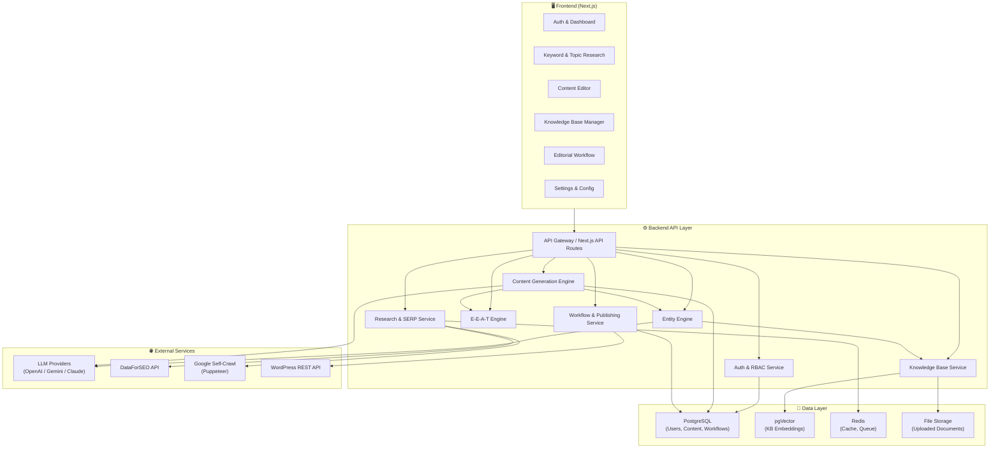
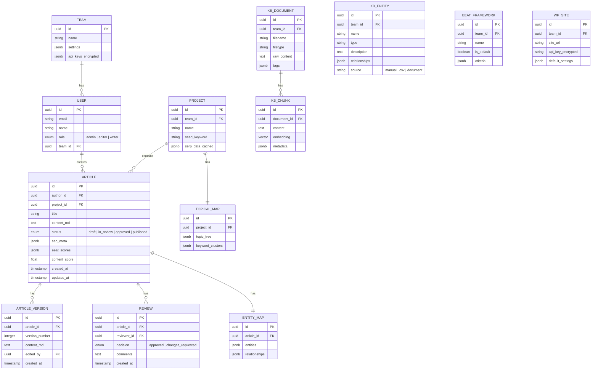

# Semantic Content & Entity SEO Platform — Spec Document

> **Version**: 1.1 (Finalized)  
> **Ngày tạo**: 29/05/2026  
> **Cập nhật**: 29/05/2026  
> **Trạng thái**: ✅ Finalized — Sẵn sàng triển khai

---

## 0. Quyết định đã chốt

| Hạng mục | Quyết định |
|---|---|
| **Hosting** | Netlify (Frontend + Serverless Functions) |
| **LLM Provider** | OpenRouter API (unified gateway → GPT-4o, Gemini, Claude, Llama…) |
| **SERP Data** | DataForSEO (primary) + Self-crawl Puppeteer (optional) |
| **Ngôn ngữ nội dung** | Đa ngôn ngữ (bất kỳ ngôn ngữ nào) |
| **Team size** | 5–20 người |
| **CSS Framework** | Tailwind CSS 4 |
| **Database** | PostgreSQL + pgVector (hosted: Neon / Supabase) |
| **Auth** | NextAuth.js v5 |
| **Output** | Markdown → WordPress REST API (1-click publish) |

---

## 1. Tổng quan dự án

### 1.1 Mục tiêu

Xây dựng nền tảng web giúp **team content** tạo nội dung chuẩn **Semantic Content & Entity SEO**, đáp ứng nghiêm ngặt tiêu chuẩn **E-E-A-T** (Experience, Expertise, Authoritativeness, Trustworthiness), và tối ưu cho cả **Google Search** lẫn **Generative AI** (GEO — Generative Engine Optimization).

### 1.2 Vấn đề cần giải quyết

| Vấn đề | Giải pháp |
|---|---|
| Content thiếu entity coverage → Google không hiểu ngữ cảnh | Auto-extract & inject entities từ SERP + LLM + Knowledge Base |
| Bài viết không đạt chuẩn E-E-A-T → ranking thấp | Auto-suggest E-E-A-T elements + custom framework enforcement |
| Quy trình viết thủ công, rời rạc → mất thời gian | Full pipeline: keyword → bài hoàn chỉnh → 1-click publish |
| Team thiếu quy trình duyệt bài chuẩn | Editorial workflow: Writer → Editor → Approve → Publish |
| Topical authority không được theo dõi | Topical Map generation & coverage tracking |

### 1.3 Đối tượng sử dụng

- **Admin**: Quản lý team, cấu hình hệ thống, quản lý API keys & LLM providers
- **Editor**: Review bài, phê duyệt, publish, quản lý Topical Map
- **Writer**: Nghiên cứu keyword, tạo nội dung, submit để review

---

## 2. Kiến trúc Module



---

### 2.1 Module Chi tiết

#### 📦 M1 — Auth & Team Management

| Tính năng | Mô tả |
|---|---|
| Đăng ký / Đăng nhập | Email + password, OAuth (Google) |
| Phân quyền RBAC | 3 roles: Admin, Editor, Writer |
| Quản lý team | Invite members, assign roles, deactivate accounts |
| API Key management | Quản lý keys cho LLM providers, DataForSEO, WordPress |

---

#### 📦 M2 — Keyword & Topic Research

| Tính năng | Mô tả |
|---|---|
| Seed keyword input | Nhập keyword chính, hệ thống mở rộng thành cluster |
| SERP Analysis (DataForSEO) | Crawl top 10-20 kết quả, trích xuất: title, headings, word count, entities, FAQ |
| SERP Analysis (Self-crawl) | Tùy chọn dùng Puppeteer crawl trực tiếp Google (có rate limiting & proxy support) |
| Topical Map Generator | Từ seed keyword → sinh cây chủ đề (topic clusters) bằng LLM |
| Competitor Gap Analysis | So sánh entity coverage giữa các đối thủ top SERP |
| Keyword Clustering | Nhóm keyword theo search intent (Informational / Commercial / Transactional / Navigational) |

**Output**: Topical Map (dạng tree/graph) + Danh sách keyword đã phân cụm + Entity gap report

---

#### 📦 M3 — Entity Engine

| Tính năng | Mô tả |
|---|---|
| SERP Entity Extraction | Trích xuất entities từ top SERP results (NER + LLM) |
| LLM Entity Suggestion | Dùng LLM phân tích topic → đề xuất entities cần có (people, places, concepts, products...) |
| Knowledge Base Matching | Cross-reference với KB nội bộ để bổ sung entities chuyên ngành |
| Entity Relationship Map | Tạo đồ thị quan hệ giữa các entities (dạng knowledge graph mini) |
| Entity Scoring | Đánh giá mức độ quan trọng của từng entity (must-have / should-have / nice-to-have) |

**Output**: Entity Map (danh sách + đồ thị quan hệ) với priority scoring

---

#### 📦 M4 — E-E-A-T Engine

| Tính năng | Mô tả |
|---|---|
| Default E-E-A-T Checklist | Bộ checklist tích hợp sẵn cho từng loại content (blog, review, how-to, news...) |
| Custom Framework Builder | Admin/Editor tự tạo framework E-E-A-T riêng (thêm/sửa/xóa tiêu chí) |
| Auto-Suggest Elements | Phân tích bài viết → đề xuất: cần thêm trích dẫn chuyên gia, số liệu thống kê, case study, nguồn tham khảo uy tín... |
| E-E-A-T Scoring | Chấm điểm compliance theo 4 tiêu chí (Experience / Expertise / Authority / Trust) |
| Framework Selection | Khi tạo bài, cho phép chọn framework E-E-A-T áp dụng (default hoặc custom) |

**Chi tiết E-E-A-T Auto-Suggest:**

```
Experience signals:
  → "Thêm đoạn chia sẻ trải nghiệm cá nhân / case study thực tế"
  → "Bổ sung hình ảnh/video minh chứng trải nghiệm"

Expertise signals:
  → "Cần trích dẫn nguồn học thuật / nghiên cứu"
  → "Thêm dữ liệu thống kê từ nguồn uy tín (Statista, Gov...)"
  → "Bổ sung giải thích chuyên sâu cho thuật ngữ chuyên ngành"

Authoritativeness signals:
  → "Thêm Author Bio với credentials"
  → "Link đến các bài viết liên quan trong cùng topic cluster"
  → "Bổ sung external links đến nguồn .gov, .edu, tổ chức uy tín"

Trustworthiness signals:
  → "Thêm ngày cập nhật bài viết"
  → "Bổ sung section 'Nguồn tham khảo' cuối bài"
  → "Thêm disclaimers nếu nội dung YMYL"
```

---

#### 📦 M5 — Content Generation Engine (Full Pipeline)

| Bước | Mô tả |
|---|---|
| 1. Outline Generation | Từ keyword + entity map + E-E-A-T framework → sinh cấu trúc bài (H1, H2, H3...) |
| 2. Section-by-Section Draft | Viết từng section với entity injection tự nhiên |
| 3. E-E-A-T Enhancement | Tự động nhúng E-E-A-T signals vào nội dung |
| 4. Internal Linking | Đề xuất internal links từ Topical Map |
| 5. Meta Generation | Tự động sinh: Title Tag, Meta Description, FAQ Schema, Slug |
| 6. Quality Review | AI self-review: kiểm tra entity coverage, E-E-A-T score, readability |

**LLM via OpenRouter (Unified Gateway):**

```
┌──────────────────────────────────────┐
│        OpenRouter API Gateway        │
│     https://openrouter.ai/api/v1     │
├──────────┬───────────┬───────────────┤
│ OpenAI   │  Google   │  Anthropic    │
│ GPT-4o   │  Gemini   │  Claude       │
│ GPT-4.1  │  2.5 Pro  │  Opus/Sonnet  │
├──────────┼───────────┼───────────────┤
│  Meta    │  Mistral  │  DeepSeek     │
│ Llama 4  │ Large 2   │  R1/V3       │
└──────────┴───────────┴───────────────┘

- Một API key duy nhất cho tất cả providers
- OpenRouter tự xử lý routing & fallback
- Model selection qua parameter `model` trong request
- Token usage tracking & cost estimation tích hợp sẵn
- Không cần quản lý nhiều API keys riêng lẻ
```

> [!TIP]
> **Lợi thế OpenRouter**: Giảm đáng kể độ phức tạp kiến trúc. Thay vì xây abstraction layer riêng cho từng provider, chỉ cần 1 HTTP client gọi đến OpenRouter. User chọn model trong UI, hệ thống truyền `model` param.

---

#### 📦 M6 — Knowledge Base Module

| Tính năng | Mô tả |
|---|---|
| Document Upload | Hỗ trợ PDF, DOCX, TXT → parse & chunk → embedding |
| Manual Entity Collection | UI để thêm entity + mô tả + quan hệ thủ công |
| CSV / Google Sheets Import | Import danh sách entity từ file CSV hoặc Google Sheets URL |
| Vector Search | Semantic search trong KB để tìm entity/thông tin liên quan |
| KB Tagging | Gắn tag ngành/chủ đề cho từng tài liệu/entity |
| Auto-Sync | Lên lịch re-index khi KB được cập nhật |

**Document Processing Pipeline:**

```
Upload → Parse (PDF/DOCX/TXT)
       → Chunk (semantic chunking, ~500 tokens/chunk)
       → Embed (OpenAI text-embedding-3-small hoặc tương đương)
       → Store (pgVector)
       → Index (metadata + tags)
```

---

#### 📦 M7 — Content Editor

| Tính năng | Mô tả |
|---|---|
| Markdown Editor | WYSIWYG editor hỗ trợ Markdown (TipTap / Milkdown) |
| Entity Highlighting | Highlight entities đã nhúng trong bài (màu theo priority) |
| Entity Checklist Panel | Panel bên phải hiển thị entity map + check đã nhúng hay chưa |
| E-E-A-T Score Panel | Hiển thị điểm E-E-A-T realtime khi viết |
| Content Score | Tổng điểm SEO: entity coverage + E-E-A-T + readability + word count |
| AI Rewrite | Chọn đoạn văn → AI rewrite với tone/style khác |
| Version History | Lưu các phiên bản chỉnh sửa, cho phép rollback |

---

#### 📦 M8 — Editorial Workflow & Publishing

| Tính năng | Mô tả |
|---|---|
| Status Pipeline | `Draft` → `In Review` → `Approved` → `Published` |
| Assign Reviewer | Writer submit → chọn Editor để review |
| Review Comments | Editor comment inline trên bài viết |
| Approve / Request Changes | Editor approve hoặc gửi lại Writer kèm feedback |
| 1-Click WordPress Publish | Đẩy bài qua WordPress REST API (title, content, category, tags, featured image) |
| Multi-site Support | Kết nối nhiều WordPress site |
| Publish History | Log lịch sử publish (ai, khi nào, site nào) |

---

## 3. Luồng dữ liệu (Data Flow)

### 3.1 Full Pipeline Flow

```mermaid
flowchart LR
    A["🔑 Seed Keyword"] --> B["📊 SERP Analysis\n(DataForSEO / Self-crawl)"]
    B --> C["🧠 Entity Extraction\n(SERP + LLM + KB)"]
    C --> D["🗺️ Entity Map\n& Topical Map"]
    D --> E["📋 Outline Generation\n(LLM + E-E-A-T Framework)"]
    E --> F["✍️ Content Generation\n(Section by Section)"]
    F --> G["🔍 Quality Review\n(Entity Coverage + E-E-A-T Score)"]
    G --> H["📝 Editor Review\n(Editorial Workflow)"]
    H --> I["🚀 1-Click Publish\n(WordPress REST API)"]

    style A fill:#6366f1,color:#fff
    style D fill:#8b5cf6,color:#fff
    style G fill:#a855f7,color:#fff
    style I fill:#ec4899,color:#fff
```



### 3.2 Chi tiết từng bước

#### Bước 1 → 2: Keyword → SERP Analysis

```
Input:  Seed keyword + target country/language
        ↓
Process: DataForSEO API call (hoặc Puppeteer crawl)
         → Lấy top 10-20 organic results
         → Extract: titles, H1-H3, content snippets, word counts
         → Extract: People Also Ask, Related Searches
        ↓
Output: Raw SERP data (cached trong Redis, TTL 24h)
```

#### Bước 2 → 3: SERP → Entity Extraction

```
Input:  Raw SERP data + KB entities (nếu có)
        ↓
Process: LLM phân tích SERP content → trích xuất named entities
         → Phân loại: Person, Organization, Place, Concept, Product, Event
         → Cross-reference với KB nội bộ
         → Scoring: must-have / should-have / nice-to-have
        ↓
Output: Entity Map (JSON) với relationships
```

#### Bước 3 → 4 → 5: Entity Map → Outline → Content

```
Input:  Entity Map + E-E-A-T Framework (default hoặc custom) + Topical Map context
        ↓
Process: LLM sinh outline (H1 → H2 → H3)
         → Mỗi heading được annotate: entities cần nhúng + E-E-A-T elements cần có
         → User review & chỉnh outline
         → LLM viết từng section với:
            • Entity injection tự nhiên
            • E-E-A-T signals nhúng sẵn
            • Internal link suggestions
        ↓
Output: Full article (Markdown) + metadata (title tag, meta desc, FAQ schema)
```

#### Bước 5 → 6 → 7: Content → Review → Publish

```
Input:  Generated article
        ↓
Process: AI Quality Check:
         → Entity coverage score (% entities đã nhúng)
         → E-E-A-T compliance score
         → Readability score
         → Content length check
         → Writer chỉnh sửa trong Editor
         → Submit to Editor review
         → Editor approve / request changes
        ↓
Output: Approved article → Push to WordPress via REST API
```

### 3.3 Data Model Overview



---

## 4. Giao diện (UI/UX)

### 4.1 Design System

| Thuộc tính | Giá trị |
|---|---|
| **Theme** | Dark mode mặc định (có toggle light mode) |
| **Color Palette** | Primary: Indigo-Violet gradient (`#6366f1` → `#8b5cf6`). Accent: Pink (`#ec4899`). Semantic: Green (pass), Amber (warning), Red (fail) |
| **Typography** | Inter (UI) + JetBrains Mono (code/editor) |
| **Style** | Glassmorphism cards, subtle micro-animations, smooth transitions |
| **Layout** | Sidebar navigation + Main content area + Context panel (right) |

### 4.2 Các màn hình chính

#### 🏠 Dashboard

```
┌─────────────────────────────────────────────────────────────┐
│  [Logo]  Semantic SEO Platform          [🔔] [👤 User ▾]   │
├──────┬──────────────────────────────────────────────────────┤
│      │                                                      │
│  📊  │   Welcome back, [Name]                               │
│ Dash │                                                      │
│      │   ┌─────────┐  ┌─────────┐  ┌─────────┐  ┌───────┐ │
│  🔍  │   │ Articles │  │ In      │  │Approved │  │Published│
│Research  │   12     │  │ Review 3│  │   5     │  │  24   │ │
│      │   └─────────┘  └─────────┘  └─────────┘  └───────┘ │
│  ✍️  │                                                      │
│Content   ┌──────────────────────────────────────────────┐   │
│      │   │  Recent Articles                        [+New]│   │
│  📚  │   │  ├─ "Hướng dẫn SEO 2026"    ● In Review      │   │
│  KB  │   │  ├─ "Entity SEO cho..."      ● Draft          │   │
│      │   │  └─ "Topical Authority..."   ✓ Published      │   │
│  👥  │   └──────────────────────────────────────────────┘   │
│ Team │                                                      │
│      │   ┌─────────────────────┐  ┌─────────────────────┐  │
│  ⚙️  │   │ Topical Coverage    │  │  E-E-A-T Avg Score  │  │
│Settings  │  ████████░░ 78%     │  │  ⭐ 8.2 / 10        │  │
│      │   └─────────────────────┘  └─────────────────────┘  │
└──────┴──────────────────────────────────────────────────────┘
```

#### 🔍 Keyword & Topic Research

```
┌──────┬──────────────────────────────────────────────────────┐
│      │                                                      │
│ Nav  │   Keyword Research                                   │
│      │                                                      │
│      │   ┌──────────────────────────────┐  [🔍 Analyze]     │
│      │   │ Enter seed keyword...        │                   │
│      │   └──────────────────────────────┘                   │
│      │   ☑ DataForSEO   ☐ Self-Crawl   LLM: [GPT-4o ▾]   │
│      │                                                      │
│      │   ┌─── Topical Map (Interactive Graph) ───────────┐  │
│      │   │                                               │  │
│      │   │         [Seed Keyword]                        │  │
│      │   │        ╱      |       ╲                       │  │
│      │   │   [Sub-topic] [Sub] [Sub-topic]               │  │
│      │   │      |          |        |                    │  │
│      │   │   [Child]    [Child]  [Child]                 │  │
│      │   │                                               │  │
│      │   └───────────────────────────────────────────────┘  │
│      │                                                      │
│      │   ┌─── Entity Map ────────────────────────────────┐  │
│      │   │ 🔴 Must-have    🟡 Should-have    🟢 Nice     │  │
│      │   │                                               │  │
│      │   │ 🔴 Google SGE    🔴 Entity SEO   🟡 NLP      │  │
│      │   │ 🔴 E-E-A-T       🟡 Schema.org   🟢 BERT    │  │
│      │   └───────────────────────────────────────────────┘  │
└──────┴──────────────────────────────────────────────────────┘
```

#### ✍️ Content Editor (Màn hình cốt lõi)

```
┌──────┬──────────────────────────────────┬───────────────────┐
│      │  📝 Content Editor               │  📊 Analysis      │
│ Nav  │                                  │                   │
│      │  Title: [Hướng dẫn Entity SEO]   │  Content Score    │
│      │  ─────────────────────────────── │  ████████░░ 82/100│
│      │                                  │                   │
│      │  ## Giới thiệu                   │  ── E-E-A-T ──    │
│      │                                  │  Experience  8/10 │
│      │  Entity SEO là phương pháp tối   │  Expertise   9/10 │
│      │  ưu hóa nội dung dựa trên các   │  Authority   7/10 │
│      │  [thực thể ngữ nghĩa] mà        │  Trust       8/10 │
│      │  Google có thể nhận diện...      │                   │
│      │                                  │  ── Entities ──   │
│      │  ## Tại sao Entity SEO quan      │  ☑ Entity SEO     │
│      │  trọng?                          │  ☑ Google SGE     │
│      │                                  │  ☐ Schema.org     │
│      │  Theo nghiên cứu của Google,     │  ☑ E-E-A-T        │
│      │  thuật toán đã chuyển từ         │  ☐ Knowledge Graph│
│      │  keyword matching sang           │  ☑ NLP            │
│      │  [entity understanding]...       │                   │
│      │                                  │  ── E-E-A-T ──    │
│      │  ─────────────────────────────── │  Suggestions      │
│      │  [B] [I] [H2] [H3] [🔗] [📷]   │                   │
│      │  [🤖 AI Rewrite] [💡 Suggest]   │  ⚠️ Thiếu trích   │
│      │                                  │  dẫn chuyên gia   │
│      │                                  │                   │
│      │                                  │  ⚠️ Cần thêm số   │
│      │                                  │  liệu thống kê    │
│      │                                  │                   │
│      │  ┌─ Submit ──────────────────┐   │  ✅ Có case study │
│      │  │ [💾 Save] [📤 Submit for  │   │                   │
│      │  │           Review]         │   │  ── Internal ──   │
│      │  └───────────────────────────┘   │  Links Suggested  │
│      │                                  │  → "Topical Auth" │
│      │                                  │  → "Semantic SEO" │
└──────┴──────────────────────────────────┴───────────────────┘
```

#### 📚 Knowledge Base Manager

```
┌──────┬──────────────────────────────────────────────────────┐
│      │                                                      │
│ Nav  │   Knowledge Base                  [+ Upload] [+ CSV] │
│      │                                                      │
│      │   ┌─ Documents ──────────────────────────────────┐   │
│      │   │  📄 seo-guidelines-2026.pdf     [Healthcare] │   │
│      │   │  📄 eeat-framework-v2.docx      [General]    │   │
│      │   │  📄 competitor-analysis.txt     [Tech]       │   │
│      │   └──────────────────────────────────────────────┘   │
│      │                                                      │
│      │   ┌─ Manual Entities ────────────────────────────┐   │
│      │   │  + Add Entity                                │   │
│      │   │                                              │   │
│      │   │  ┌─────────────┬──────────┬────────────────┐ │   │
│      │   │  │ Entity      │ Type     │ Related To     │ │   │
│      │   │  ├─────────────┼──────────┼────────────────┤ │   │
│      │   │  │ Google SGE  │ Product  │ Google, AI     │ │   │
│      │   │  │ E-E-A-T     │ Concept  │ Google, SEO    │ │   │
│      │   │  │ John Mueller│ Person   │ Google, SEO    │ │   │
│      │   │  └─────────────┴──────────┴────────────────┘ │   │
│      │   └──────────────────────────────────────────────┘   │
└──────┴──────────────────────────────────────────────────────┘
```

#### 👥 Editorial Workflow

```
┌──────┬──────────────────────────────────────────────────────┐
│      │                                                      │
│ Nav  │   Editorial Board                                    │
│      │                                                      │
│      │   ┌─ Kanban View ────────────────────────────────┐   │
│      │   │                                              │   │
│      │   │  📝 Draft    │ 🔍 Review  │ ✅ Approved │ 🚀  │   │
│      │   │  ─────────  │ ─────────  │ ──────────  │ Pub │   │
│      │   │             │            │             │     │   │
│      │   │  ┌───────┐  │ ┌───────┐  │ ┌───────┐  │     │   │
│      │   │  │Art. 1 │  │ │Art. 3 │  │ │Art. 5 │  │     │   │
│      │   │  │Writer A│  │ │Writer B│  │ │Ready! │  │     │   │
│      │   │  └───────┘  │ └───────┘  │ └───────┘  │     │   │
│      │   │  ┌───────┐  │            │             │     │   │
│      │   │  │Art. 2 │  │            │             │     │   │
│      │   │  │Writer A│  │            │             │     │   │
│      │   │  └───────┘  │            │             │     │   │
│      │   │             │            │             │     │   │
│      │   └──────────────────────────────────────────────┘   │
│      │                                                      │
│      │   ┌─ Review Detail ──────────────────────────────┐   │
│      │   │  "Hướng dẫn Entity SEO" — by Writer A        │   │
│      │   │  Score: 82/100  │  E-E-A-T: 8.2  │  Entities│   │
│      │   │                                    Coverage: │   │
│      │   │  [👁️ Preview]  [✅ Approve]  [↩️ Request     │   │
│      │   │                              Changes]        │   │
│      │   └──────────────────────────────────────────────┘   │
└──────┴──────────────────────────────────────────────────────┘
```

---

## 5. Đề xuất Tech Stack

| Layer | Công nghệ | Lý do |
|---|---|---|
| **Frontend** | Next.js 15 (App Router) + TypeScript | SSR, API routes tích hợp, ecosystem React mạnh |
| **UI Components** | Shadcn/ui + Radix UI | Accessible, customizable, phù hợp dark theme |
| **Styling** | Tailwind CSS 4 | Utility-first, nhanh, dễ maintain cho team |
| **Markdown Editor** | TipTap (ProseMirror-based) | Extensible, hỗ trợ collaborative editing, plugin entity highlighting |
| **State Management** | Zustand + TanStack Query | Lightweight, server state caching tốt |
| **Backend** | Next.js API Routes + tRPC | Type-safe API, giảm boilerplate |
| **Database** | PostgreSQL 16 (Neon) + Prisma ORM | Serverless-compatible, Prisma type-safe queries |
| **Vector DB** | pgVector extension (trên Neon) | Tích hợp trực tiếp PostgreSQL, không cần DB riêng |
| **Cache** | Upstash Redis | Serverless Redis, tương thích Netlify Functions |
| **Auth** | NextAuth.js v5 | OAuth + credentials, RBAC middleware |
| **LLM Integration** | OpenRouter API (`openai` SDK compatible) | 1 API key → tất cả LLM providers, streaming support |
| **SERP API** | DataForSEO REST API | Reliable, comprehensive SERP data |
| **Self-Crawl** | Puppeteer + proxy rotation | Fallback option, cần rate limiting |
| **File Processing** | LangChain.js document loaders | PDF/DOCX parsing + chunking |
| **WordPress** | wpapi (npm) | WordPress REST API client |
| **Deployment** | Netlify (frontend + functions) + Neon (DB) + Upstash (Redis) | Serverless-first, auto-scaling |
| **Graph Visualization** | React Flow / D3.js | Topical Map & Entity relationship graphs |

> [!IMPORTANT]
> **Kiến trúc Serverless trên Netlify**: Next.js sẽ chạy trên Netlify với `@netlify/plugin-nextjs`. API Routes tự động chuyển thành Netlify Functions. Database dùng Neon (serverless PostgreSQL) và Upstash (serverless Redis) để đảm bảo tương thích với mô hình serverless.

---

## 6. Phân pha triển khai (Roadmap)

### Phase 1 — Foundation (Tuần 1-3)

- [ ] Setup project (Next.js + DB + Auth)
- [ ] M1: Auth & Team Management (đăng ký, đăng nhập, RBAC)
- [ ] M7: Content Editor cơ bản (Markdown editor)
- [ ] Database schema & Prisma setup
- [ ] UI Design System (dark theme, components)

### Phase 2 — Core Intelligence (Tuần 4-6)

- [ ] M2: Keyword & Topic Research (DataForSEO integration)
- [ ] M3: Entity Engine (LLM entity extraction & scoring)
- [ ] M5: Content Generation Engine (outline → full article)
- [ ] LLM Provider abstraction layer (OpenAI + Gemini + Claude)

### Phase 3 — E-E-A-T & Knowledge Base (Tuần 7-8)

- [ ] M4: E-E-A-T Engine (default checklist + custom framework)
- [ ] M6: Knowledge Base (upload, manual entities, CSV import)
- [ ] pgVector setup & semantic search
- [ ] Entity highlighting trong editor

### Phase 4 — Workflow & Publishing (Tuần 9-10)

- [ ] M8: Editorial Workflow (Kanban, review, approve)
- [ ] WordPress REST API integration (1-click publish)
- [ ] Version history
- [ ] Notification system

### Phase 5 — Polish & Launch (Tuần 11-12)

- [ ] Self-crawl Google (Puppeteer) option
- [ ] Content Score & E-E-A-T Score dashboards
- [ ] Performance optimization
- [ ] Testing & bug fixes
- [ ] Documentation

---

## 7. Open Questions — ✅ Đã giải quyết

> Tất cả câu hỏi đã được trả lời. Dự án sẵn sàng triển khai.

| # | Câu hỏi | Trả lời |
|---|---|---|
| 1 | Hosting & LLM Provider | Netlify + OpenRouter API |
| 2 | Team size | 5–20 người |
| 3 | Ngôn ngữ nội dung | Đa ngôn ngữ (bất kỳ) |
| 4 | CSS Framework | Tailwind CSS 4 |
| 5 | SERP Data | DataForSEO + Self-crawl (tùy chọn) |
| 6 | Output | Markdown → WordPress REST API |
